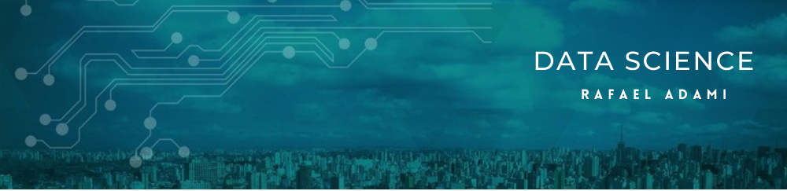

   

  

# Rafael Adami
*Big Data and RPA Leader* at CPFL Energia

As a experienced software enginner I combine analytical, development and management skills, ability to work in team environments, and attention to details. Having spend the last years working in great companies in diferrent market segments that gave me the opportunity to develop a critical thinking and problem-solving skills.

My credentials include a B.A in Electric enginnering, modality electronics, emphasis in Telecommunications from Inatel (National Institute of Telecommunications) an institution of higher education rated as one of the top and most prestigious engineering schools in Brazil. 

**Background in:** Python, Machine Learning, Google Cloud Platform, Java, C/C++, Digital TV Systems, Web and Android Development and others.

**Links:**
* [LinkedIn](https://www.linkedin.com/in/rafaeladami/)
* [Linktree](https://linktr.ee/rafael_adami)
* [Instagram](https://www.instagram.com/rafael_adami/)

## Projetos:
Veja a lista de tutoriais:

* **Examples using numpy python package to data science projects:** https://bit.ly/3aniOmX
* **Python code using opencv library to detect faces in an image.:** https://bit.ly/3oDfjxS

---

